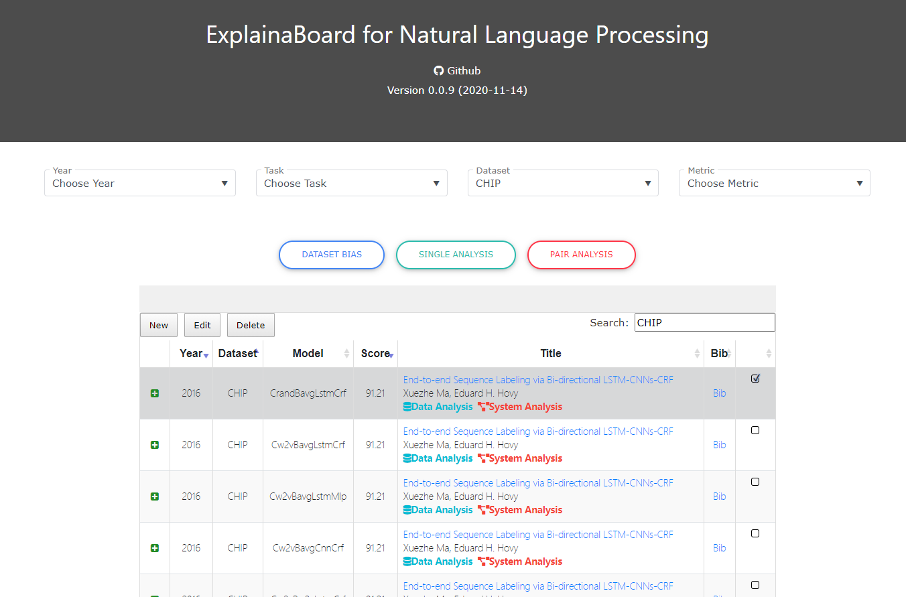
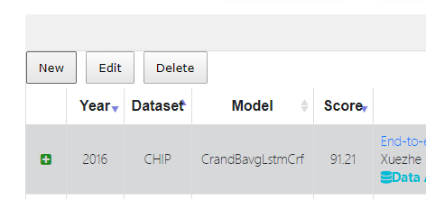

### by [Pengfei Liu](http://pfliu.com/), [Jinlan Fu](https://scholar.google.com/citations?hl=en&user=D4vtw8QAAAAJ), [Yang Xiao](), [Graham Neubig](http://phontron.com/) and other contributors.


This project is supported by two following works:

* [Interpretable Multi-dataset Evaluation for Named Entity Recognition (EMNLP-2020)](https://www.aclweb.org/anthology/2020.emnlp-main.489.pdf)

* [RethinkCWS: Is Chinese Word Segmentation a Solved Task? (EMNLP-2020)](https://www.aclweb.org/anthology/2020.emnlp-main.457.pdf)

<br> 

## Final Product: [ExplainaBoard](http://explainaboard.nlpedia.ai/) (Updating)
<!--  -->


## Updates:
* Added one SOTA NER system and two top-scoring systems on CoNLL03, [check out](http://explainaboard.nlpedia.ai/?search=CoNLL). 
Thanks [Ikuya Yamada](http://www.ikuya.net/index-en.html) and [Stefan Schweter](https://github.com/stefan-it) for their sharing results.


<br> 


## 1. Motivated Questions


* #### Performance of many NLP tasks has reached a plateau. What works, and what's next?
* #### <strong>Is XX a solved task? What's left?</strong>
* #### A good evaluation metric can not only rank different systems but also tell their relative advantages (strengths and weaknesses) of them.
* #### Next-generation of `Leaderboard`: equip it with powerful analysis ability?


<br> 


## 2. Interpretable Evaluation Methodology


The evaluation methodology generally consists of following steps.


<!--  -->


### 2.1 Attribute Definition
Taking NER and CWS tasks for example, we have defined 8 attributes for the NER task, and 7 attributes for the CWS task.

| Id |              NER            | 			   CWS 			     | 
|----|-----------------------------|---------------------------------|
| 1  | Entity Length   		       | Word Length                     | 
| 2  | Sentence Length             | Sentence Length                 | 
| 3  | OOV Density                 | OOV Density                     | 
| 4  | Token Frequency       	   | Character Frequency             | 
| 5  | Entity Frequency            | Word Frequency                  | 
| 6  | Label Consistency of Token  | Label Consistency of Character  | 
| 7  | Label Consistency of Entity | Label Consistency of Word       | 
| 8  | Entity Density			   |                                 |

### 2.2 Bucketing 
Bucketing is an operation that breaks down the holistic performance into different categories. This can be achieved by dividing the set of test entities into different subsets of test entities (regarding spanand sentence-level attributes) or test tokens (regarding token-level attributes). 

### 2.3 Breakdown
Calculate the performance of each bucket.

### Summary Measures
Summarize quantifiable results using statistical measures


<br> 

## 3. Application


### 3.1 System Diagnosis
* Self-diagnosis
* Aided-diagnosis


### 3.2 Dataset Bias Analysis


### 3.3 Structural Bias Analysis 


<br> 


## 4. Interpreting Your Results?


### 4.1 Method 1: Upload your files to  the [ExplainaBoard](http://explainaboard.nlpedia.ai/) website



### 4.2 Method 2: Run it Locally
Give the Named Entity Recognition task as an example. Run the shell: `./run_task_ner.sh`.

The shell scripts include the following three aspects:

- `tensorEvaluation-ner.py` -> Calculate the dependent results of the fine-grained analysis.

- `genFig.py` -> Drawing figures to show the results of the fine-grained analysis.

- `genHtml.py` -> Put the figures drawing in the previous step into the web page.

After running the above command, a web page named `tEval-ner.html` will be generated for displaying the analysis and diagnosis results of the models. 

The running process of the Chinese Word Segmentation task is similar.


#### 4.2.1 Requirements:
- `python3`
- `texlive`
- `poppler`
- `pip3 install -r requirements.txt`


#### 4.2.2 Analysis and diagnosis your own model.

Take CoNLL-2003 datasets as an example.

- Put the result-file of your model on this path: `data/ner/conll03/results/` (It contains three columns separated by space: token, true-tag, and predicted-tag). In order to carry out model diagnosis, two or more model result files must be included. You can also choose one of the result files provided by us as the reference model.

- Name the train- and test-set (the dataset related to your result-file) as 'train.txt' and 'test.txt', and then put them on the path: `data/ner/conll03/data/`.

- Set the `path_data` (path of training set), `datasets[-]` (dataset name), `model1` (the first model's name), `model2` (the second model's name), `resfiles[-]` (the paths of the results) in `run_task_ner.sh` according to your data.

- Run: `./run_task_ner.sh`. The analysis results will be generated on the path `output_tensorEval/ner/your_model_name/`.

```
   Notably, so far, our system only supports limited tasks and datasets, 
   we're extending them currently!
```

#### 4.2.3 Generate the HTML code
As introduced in section 4.2.2, we have generated the analysis results on the path `output_tensorEval/ner/your_model_name/`. Next, we will generate the HTML code base on the analysis results. In the `./run_task_ner.sh`, the codes after `#run pdflatex .tex` are used to generate the HTML code. Before running `./run_task_ner.sh`, you need to make sure that you have installed the `texlive` and `poppler`.

Other illustrations of the `./run_task_ner.sh` code are as follows:

- `genFig.py` generates the `latex` codes about the analysis charts (e.g. bar-chart, heatmap).

- `pdflatex $file.tex` generates a figure with `.pdf` format based on the latex code.

- `pdftoppm -png $file.pdf` converts the figure with `.pdf` into the `.png` format.

- `genHtml.py` generates the HTML code that arranges the analysis figures and tables.


#### 4.2.4 Note: 
- **More than two result files are required.**  Because comparative-diagnosis is to compare the strengths and weaknesses of the model architectures and pre-trained knowledge between two or more models, it is necessary to input as least two model results. 

- **The result file must include three columns of words, true-tags, and predicted-tags, separated by space.** If your result file is not in the required format, you can modify the function `read_data()` in file `tensorEvaluation-ner.py` to adapt to your format. 


Here are some generated results of preliminary evaluation systems: Named Entity Recognition (NER), Chinese Word Segmentation (CWS), Part-of-Speech (POS), and Chunking.
* [NER](http://pfliu.com/tensorEvaluation/tEval-ner.html)
* [CWS](http://pfliu.com/tensorEvaluation/tEval-cws.html)
* [POS](http://pfliu.com/tensorEvaluation/tEval-pos.html)
* [Chunk](http://pfliu.com/tensorEvaluation/tEval-chunk.html)


