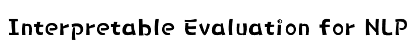

### by [Pengfei Liu](http://pfliu.com/), [Jinlan Fu](https://scholar.google.com/citations?hl=en&user=D4vtw8QAAAAJ), [Graham Neubig](http://phontron.com/) and other contributors.


This project is a by-product of these works:

1) [Interpretable Multi-dataset Evaluation for Named Entity Recognition (EMNLP-2020)](https://www.aclweb.org/anthology/2020.emnlp-main.489.pdf)

2) [RethinkCWS: Is Chinese Word Segmentation a Solved Task? (EMNLP-2020)](https://www.aclweb.org/anthology/2020.emnlp-main.457.pdf)


## Motivated Questions


* #### Performance of many NLP tasks has reached a plateau. What works, and what's next?
* #### <strong>Is XX a solved task? What's left?</strong>
* #### A good evaluation metric can not only rank different systems but also tell their relative advantages (strengths and weaknesses) of them.


## Interpretable Evaluation Methodology

### An example 


### Attribute definition
Overall, we have define 8 attributes for the NER task, and 7 attributes for the CWS task.

| Id |              NER            | 			   CWS 			     | 
|----|-----------------------------|---------------------------------|
| 1  | Entity Length   		       | Word Length                     | 
| 2  | Sentence Length             | Sentence Length                 | 
| 3  | OOV Density                 | OOV Density                     | 
| 4  | Token Frequency       	   | Character Frequency             | 
| 5  | Entity Frequency            | Word Frequency                  | 
| 6  | Label Consistency of Token  | Label Consistency of Character  | 
| 7  | Label Consistency of Entity | Label Consistency of Word       | 
| 8  | Entity Density			   |                                 |

### Bucketing 
Bucketing is an operation that breaks down the holistic performance into different categories. This can be achieved by dividing the set of test entities into different subsets of test entities (regarding spanand sentence-level attributes) or test tokens (regarding token-level attributes). 

### Breakdown
Calculate the performance of each bucket.


## Application


### ExplainaBoard: Next Generation of LeaderBoard


### System Diagnosis
* Self-diagnosis
* Aided-diagnosis


### Dataset Bias Analysis


### Structural Bias Analysis 


## Interpreting Your Results?


### Method 1: Upload your files to  the ``ExplainaBoard`` website


### Method 2: Run it Locally
Give the Named Entity Recognition task as an example. Run the shell: `./run_task_ner.sh`.

The shell scripts include the following three aspects:

- `tensorEvaluation-ner.py` -> Calculate the dependent results of fine-grained analysis.

- `genFig.py` -> Drawing figures to show the results of the fine-grained analysis.

- `genHtml.py` -> Put the figures drawing in the previous step into the web page.

After running the above command, a web page named `tEval-ner.html` will be generated for displaying the analysis and diagnosis results of the models. 

The running process of the Chinese Word Segmentation task is similar.

```
   Notably, so far, our system only supports limited tasks and datasets, we're extending them currently!
```

Here are some generated results of preliminary evaluation systems: Named Entity Recognition (NER), Chinese Word Segmentation (CWS) and Part-of-Speech (POS).
* [NER](http://pfliu.com/tensorEvaluation/tEval-ner.html)
* [CWS](http://pfliu.com/tensorEvaluation/tEval-cws.html)
* [POS](http://pfliu.com/tensorEvaluation/tEval-pos.html)
* [Chunk](http://pfliu.com/tensorEvaluation/tEval-chunk.html)


