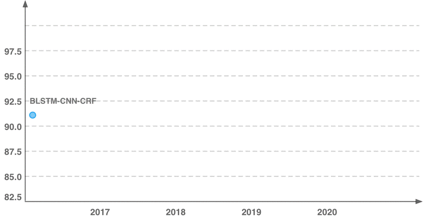

# Interpretable Evaluation for NLP Tasks


by Pengfei Liu, Jinlan Fu, Graham Neubig and other contributors.


## Motivated Questions




## A Quick Look

### ExplainaBoard

### Interpretable Evaluation Results
Here are some generated results of three preliminary evaluation systems: Named Entity Recognition (NER), Chinese Word Segmentation (CWS) and Part-of-Speech (POS).
* [NER](http://pfliu.com/tensorEvaluation/tEval-ner.html)
* [CWS](http://pfliu.com/tensorEvaluation/tEval-cws.html)
* [POS](http://pfliu.com/tensorEvaluation/tEval-pos.html)
* [Chunk](http://pfliu.com/tensorEvaluation/tEval-chunk.html)


## What's the use of `Interpretable` Evaluation?
* understand the strengths and weaknesses of a SOTA system
* which factors of a dataset influence the performance of a task 
* how different choices of architectures influence one task's performance


## Setup

* python3.7
* install texlive 
```
sudo apt-get install texlive-full
```
* install
```
sudo apt install poppler-utils
```

## how to run the NER-TensorEvaluation-print
- Unzip `NER-TensorEvaluation-print.zip` and run `run_task_ner_print.sh`. you will get the dictionary with the six evaluation metrics.
 
- If you want to do the `bootstrap sampling` experiment, you can sample part of the dataset through the method `new_metric()`.  
(Maybe you can sample data by the output of `read_data()`.)

## Still In Progress ...
